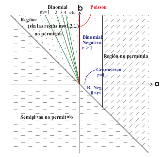

\newcommand{\WiD}{\operatorname{\text{Wi}}}
\newcommand{\WeD}{\operatorname{\text{We}}}
\newcommand{\WeNormD}{\operatorname{\text{We-N}}}
\newcommand{\ExpD}{\operatorname{\text{Exp}}}
\newcommand{\BeD}{\operatorname{\text{Be}}}
\newcommand{\GeoD}{\operatorname{\text{Geo}}}
\newcommand{\StD}{\operatorname{\text{St}}}
\newcommand{\NormD}{\operatorname{\text{N}}}
\newcommand{\GaD}{\operatorname{\text{Ga}}}
\newcommand{\UniD}{\operatorname{\text{U}}}
\newcommand{\DirD}{\operatorname{\text{Dir}}}
\newcommand{\IG}{\operatorname{\text{InG}}}
\newcommand{\IncGa}{\operatorname{\text{IGa}}}
\newcommand{\IGa}{\operatorname{\text{InGa}}}
\newcommand{\PoD}{\operatorname{\text{Po}}}
\newcommand{\BS}{\operatorname{\text{BS}}}
\newcommand{\DP}{\operatorname{\text{DP}}}
\newcommand{\BinD}{\operatorname{\text{Bin}}}
\newcommand{\BinNegD}{\operatorname{\text{BinNeg}}}
\newcommand{\dd}{\mathrm{d}}
\newcommand{\Indic}{\mathbb{I}}
\newcommand{\Borel}{\operatorname{\mathscr{B}}}
\newcommand{\Filtration}{\operatorname{\mathscr{F}}}
\newcommand{\Expec}{\operatorname{\mathbb{E}}}
\newcommand{\Var}{\operatorname{\text{var}}}


# Objetivos

`Parte 1`

* Estudiaremos algunas conexiones entre las distribuciones de frecuencias de siniestros.

* Estudiaremos aspectos de temporalidad en la especificacion de estas distribuciones.

`Parte 2`

* Estudiaremos la nocion de modificacion de distribuciones

* Revisaremos aspectos inferenciales asociados con esta modificaciones


# Preambulo

En esta seccion consideramos que estamos trabajando con la especificacion del riesgo agregado, $S_t$, bajo el **enfoque de riesgo colectivo**, es decir
$$
S_t = \sum_{j=1}^{N_t} Y_{tj},
$$
donde 

* $Y_{tj}$ denota el $j$-esimo monto de siniestro (ocurrido) en el periodo $t$ condicional en $\iota_{tj}=1$ (i.e. $Y_{tj}>0$).

## Un caso particular

Recordemos que bajo el supuesto que cada poliza pueda siniestrarse solo una vez en el periodo, la frecuencia de siniestros $N_t$ puede expresarse como,
$$
N_t=\sum_{i=1}^{J_t}\iota_{ti},
$$
donde ahora $i$-denota el indice de las polizas suscritas en el periodo $t$, siendo $J_t$ la suscripcion total del portafolio de seguros en $t$.

En esta sesion prestaremos atencion a algunos modelos de probabilidad empleados para describir la incertidumbre entorno a $N_t$. 

*Posteriormente analizaremos la modelacion de las severidades/monto de siniestros individuales.*

# Frecuencia de Siniestros

Los modelos usualmente asociados con $N_t$ son del tipo parametrico.

## Distribucion binomial

Se dice que $N$ sigue una distribucion binomial, $Bin(n|J,\theta)$, cuando
\begin{eqnarray}
  \mathbb{E}(N) & = & J\theta
  \nonumber \\
  var(N) & = & J\theta(1-\theta)
  \nonumber \\
  M_{N}(t) & = & \left(\theta e^{t}+1-\theta\right)^{J}
  \nonumber \\
  P_{N}(t) & = & \left(\theta t+1-\theta\right)^{J}.
  \nonumber
\end{eqnarray}

El parametro $0<\theta<1$ se interpreta como $\mathbb{P}(\text{siniestro})$ para cualquier poliza dentro del portafolio de seguros, referente al periodo de operacion.

La distribucion binomial se usa en el contexto donde cada poliza en el portafiolio puede producir solo un reclamo dentro del periodo de operacion. 

**Presupone que cada poliza puede siniestrase a lo mas solo una vez en el periodo de operaciones.**

### Calculo y visualizacion


```{r binomial_plot, include=TRUE}
Binomial.Plot <-function(n, p, low=0, high=n,scale = F, a=NA,b=NA,calcProb=!all(is.na(c(a,b))),quantile=NA,calcQuant=!is.na(quantile)){
  # Binomial
  sd = sqrt(n * p * (1 - p))
  if(scale && (n > 10)) {
    low = max(0, round(n * p - 4 * sd))
    high = min(n, round(n * p + 4 * sd))
  }
  values = low:high
  probs = dbinom(values, n, p)
  plot(c(low,high), c(0,max(probs)), type = "n", 
       xlab = "Numero de casos",
       ylab = "Masa de probabilidad",
       main = "")
  lines(values, probs, type = "h", col = 2)
  abline(h=0,col=3)
  if(calcProb) {
    if(is.na(a))
      a = 0
    if(is.na(b))
      b = n
    if(a > b) {
      d = a
      a = b
      b = d
    }
    a = round(a)
    b = round(b)
    prob = pbinom(b,n,p) - pbinom(a-1,n,p)
    title(paste("P(",a," <= N <= ",b,") = ",round(prob,6),sep=""),line=0,col.main=4)
    u = seq(max(c(a,low)),min(c(b,high)),by=1)
    v = dbinom(u,n,p)
    lines(u,v,type="h",col=4)
  }
  else if(calcQuant==T) {
    if(quantile < 0 || quantile > 1)
      stop("El cuantil debe estar entre 0 y 1")
    x = qbinom(quantile,n,p)
    title(paste(" ",quantile," quantile = ",x,sep=""),line=0,col.main=4)
    u = 0:x
    v = dbinom(u,n,p)
    lines(u,v,type="h",col=4)
  }
  return(invisible())
}
```

```{r}
Binomial.Plot(100,.3)
```

```{r}
Binomial.Plot(100,0.3,a=27,b=33,scale=T)
```

Revisen la funcion `Binomial.Plot()` en el archivo `markdown` de esta presentacion.

## Distribucion Poisson

La distribucion Poisson es quizas la distribucion de frecuencias de siniestros mas empleada en la practica y en la teoria.

Se dice que $N$ se distribuye Poisson, $Po(n|\lambda)$ cuando,
\begin{eqnarray}
  \mathbb{E}(N) & = & \lambda
  \nonumber \\
  var(N) & = & \lambda
  \nonumber \\
  M_{N}(t) & = & \exp\left\{\lambda\left(e^{t}-1\right)\right\}
  \nonumber \\
  P_{N}(t) & = & \exp\left\{\lambda\left(t-1\right)\right\},
  \nonumber
\end{eqnarray}
donde $\lambda$ es la tasa de intensidad de siniestros referente al periodo de operacion.

Al igual que la distribucion binomial negativa, esta distribucion se emplea en el caso donde cada poliza dentro del portafolio de seguros puede producir mas de un siniestro en el periodo de operacion.

**Esta dsitribucion presupone que cada poliza puede siniestrarse mas de una vez en el periodo de operaciones.**

### Calculo y visualizacion

Revisen la funcion `Poisson.Plot()` en el `markdown` de esta presentacion.

```{r poisson_plot, include=TRUE}
Poisson.Plot <- function(mu, a=NA,b=NA,calcProb=(!is.na(a) | !is.na(b)),quantile=NA,calcQuant=!is.na(quantile)){
  # Poisson
  sd = sqrt(mu)
  low = max(0, round(mu - 3 * sd))
  high = round(mu + 5 * sd)
  values = low:high
  probs = dpois(values, mu)
  plot(c(low,high), c(0,max(probs)), type = "n", 
       xlab = "Numero de casos",
       ylab = "Masas de probabilidad",
       main = "")
  lines(values, probs, type = "h", col = 2)
  abline(h=0,col=3)
  if(calcProb) {
    if(is.na(a)){ a = 0 }
    if(is.na(b)){
      a = round(a)
      prob = 1-ppois(a-1,mu)
      title(paste("P(",a," <= Y ) = ",round(prob,6),sep=""),line=0,col.main=4)
      u = seq(max(c(a,low)),high,by=1)
    }
    else {
      if(a > b) {d = a; a = b; b = d;}
      a = round(a); b = round(b)
      prob = ppois(b,mu) - ppois(a-1,mu)
      title(paste("P(",a," <= N <= ",b,") = ",round(prob,6),sep=""),line=0,col.main=4)
      u = seq(max(c(a,low)),min(c(b,high)),by=1)
    }
    v = dpois(u,mu)
    lines(u,v,type="h",col=4)
  }
  else if(calcQuant==T) {
    if(quantile < 0 || quantile > 1)
      stop("El cuantil debe estar entre 0 y 1")
    x = qpois(quantile,mu)
    title(paste("",quantile," quantile = ",x,sep=""),line=0,col.main=4)
    u = 0:x
    v = dpois(u,mu)
    lines(u,v,type="h",col=4)
  }
  return(invisible())
}
```

## Distribucion binomial-negativa

Se dice que $N$ tiene una distribucion binomial negativa, $BinNeg(n|r,\theta)$ si
\begin{eqnarray}
  \mathbb{E}(N) & = & \frac{r(1-\theta)}{\theta}
  \nonumber \\
  var(N) & = & \frac{r(1-\theta)}{\theta^{2}}
  \nonumber \\
  M_{N}(t) & = & \left(\frac{\theta}{1-(1-\theta)e^{t}}\right)^{r}
  \nonumber \\
  P_{N}(t) & = & \left(\frac{\theta}{1-(1-\theta)t}\right)^{r},
  \nonumber
\end{eqnarray}
para $r$ entero positivo y $0<\theta<1$.

Esta distribucion se emplea en el caso de portafolios en los que cada polia puede producir mas de un reclamo dentro del periodo de operacion.

**Esta dsitribucion presupone que cada poliza puede siniestrarse mas de una vez en el periodo de operaciones.**

### Calculo y visualizacion

Modifiquen la funcion `Poisson.Plot()` para crear la funcion `BinNeg.Plot()` para generar los resultados analogos de `Poisson.Plot()` y `Binomial.Plot()` incluidas en el `markdown` de esta presentacion.


## Clase (a,b,0)

Las distribuciones `binomial`, `Poisson` y `binomial negativa` pueden expresarse como una clase de distribuciones mas general, con *decrementos exponenciales o tasas de cambio lineal* en las $(p_n)_{n\in\mathcal{N}}$. Esta clase es conocida como la **clase** $(a,b,0)$.
	  	
Las masas de probabilidades, $\Pr(N=n)=p_n$, en esta clase se definien de **manera recursiva**, como 
$$
\frac{p_n}{p_{n-1}} = a + \frac{b}{n},
$$
para $n=1,2,3,\ldots$.
 		
El valor 
$$
p_0 := \Pr(N=0)
$$
se define como un parametro adicional inicial.
 	
### Soporte

El **soporte** de las distribuciones $(\alpha,\beta)$, para $\mathcal{N}$, es tipicamente un subconjunto de los enteros positivos, i.e. 
$$
\mathcal{N} 
\subseteq
\mathbb{N}_0=\{0\}\cup \{1,2,3,\ldots\}.
$$
		
Sin embargo, puede definirse tambien sobre **latices**, que son soportes 
$$
\mathcal{K}=\{kn:n\in\mathcal{N}\},
$$
para algun escalar $k$

Este se usa para definir **distribuciones de probabilidad sobre rangos** de variables --que es de utilidad para severidades individuales ranqueadas--.

### Usos

El uso de las distribuciones $(\alpha,\beta,0)$ se relaciona principalmente con las formulas de recursion (especificamente la recursion de Panjer) para calcular la distribucion de $S$, **monto agregado de distribuciones** (lo estudiaremos mas adelante).

### Relaciones


Los valores especificos de $(\alpha,\beta)$ y $p_0$ asociados con las distribuciones parametricas convencionales estan dados en la siguiente tabla.


| Distribucion | $p_0$    | $\alpha$  | $\beta$  |
|--------------|:--------:|:---------:|:--------:|
| $\text{Po}(\cdot|\lambda)$        | $e^{-\lambda}$    | $0$ | $\lambda$ |
| $\text{BinNeg}(\cdot|r,\theta)$   | $(1+\theta)^{-r}$ | $\frac{\theta}{1+\theta}$ | $r\left(\frac{\theta}{1+\theta}\right)$ |
| $\text{Bin}(\cdot|J,\theta)$      | $(1-\theta)^{J}$  | $-\frac{\theta}{1-\theta}$ | $(J+1)\left(\frac{\theta}{1-\theta}\right)$ |


El caso de la distribucion $\text{Geo}(\cdot|\theta)$ se deriva directamente del caso correspodiente en la tabla anterior.	

### Parametrizacion




### Calculo y visualizacion

Vean la funcion `aboclass()` en `R`.

```{r ab0_pmf, echo=TRUE}
ab0class <- function(alpha, beta, pO, K){
  ab0dist <- array(NA, dim=c(K+1,3))
  ab0dist[,1] <- seq(0:K)-1
  ab0dist[1,2] <- p0
  k <- 1
  for(k in 1:K){
    ab0dist[(k+1),2] <- as.numeric(ab0dist[k,2] %*% (alpha + beta/k)) 
    }
  ab0dist[,3] <- cumsum(ab0dist[,2])
  return(ab0dist)
  }
```

### Comparativo


```{r ab0_plot_comparacion, echo=FALSE}
if(!require("ggplot2")){install.packages("ggplot2")}
suppressMessages(library("ggplot2"))
ggplot(data.frame(x=c(0:20)), aes(x)) +
    geom_point(aes(y=dpois(x, 10)), colour="red", 
               ylab = "masa de probabildad", xlab="N") +
    geom_point(aes(y=dbinom(x, 100, 0.1)), colour="blue") +
    geom_point(aes(y=dnbinom(x, 90, 0.9)), colour="green")
```

### Comentarios

* En `azul` marcamos las masas de probabilidad de la `distribucion binomial`

* En `verde` marcamos las masas de probabilidad de la `distribucion binomial-negativa`

* En `rojo` marcamos las masas de probabilidad de la `distribucion Poisson`

Asi, vemos que la distribucion `binomial negativa` es la *mas dispersa*, la `binomial` la *menos dispersa*. La distribucion `Poisson` esta entre ambas.

### Ejemplo: Poisson


```{r abo_plot_poisson, echo=TRUE}
K <- 100
alpha <- 0
beta <- 30
p0 <- exp(-beta)
ab0dist <- ab0class(alpha, beta, pO, K)

plot(ab0dist[,1],ab0dist[,2],type="h", ylab="P(N=n)", col=2, xlab="n", main="");abline(h=0:1,col=3)
points(ab0dist[,1],ab0dist[,2],col=2);abline(h=0,col=3)
```


# Propiedades

## Agregacion de variables aleatorias Poisson

Supongamos que $N_1,\ldots,N_q$ son variables aleatorias independientes con distribucion Poisson, $\text{Po}(N_j=n_j|\lambda_j)$, respectivamente, con $\lambda_j$s posiblemente diferentes. Se sigue,  
	  	\begin{itemize}
	  		\item $N = \sum_{j=1}^{q}N_j$ se distribuye Poisson
	  		\item $N$ tiene tasa de intensidad $\lambda=\sum_{j=1}^{q}\lambda_j$
	  	\end{itemize}
	  	

## Desagregacion de variables aleatorias Poisson

Supongamos que $N \sim \text{Po}(n|\lambda)$, con $\lambda > 0$, y consideremos que los eventos pueden clasificarse en $m$ tipos distintos independientes, con probabilidades $p_1,\ldots,p_m$. Se sigue,
	  	\begin{itemize}
	  		\item $N_j$s, que son los numeros de eventos en cada clase, son mutuamente independientes
	  		\item Cada $N_j$ tiene distribucion $\text{Po}(n|\lambda_j)$, con $\lambda_j=p_j\lambda$
	  	\end{itemize}


# Modificacion de distribuciones

Recordemos que $N_t$ denota el numero de siniestros de un periodo de operacion $t$.

Usualmente concebimos el soporte de $N_t$ de dos formas:

1. **Riesgo individual.-** Suponiendo que cada poliza puede siniestrarse a lo mas una vez en $t$, tenemos un **soporte finito**
$$
\mathcal{N}=\{0,1,2,\ldots,J_t\}.
$$
2. **Riesgo colectivo.-** Suponiendo que cada poliza puede siniestrarse mas de una vez en $t$, tenemos un **soporte numerable**
$$
\mathcal{N}=\{0,1,2,\ldots\}.
$$

## Masas de probabilidades


En ambos enfoques para $\mathcal{N}$ tenemos un conjunto de *masas de probabilidades*,
$$
\left(p_n\right)_{n\in\mathcal{N}},
$$
donde 
$$
p_n:=\mathbb{P}(N_t=n),
$$
para todo $n\in\mathcal{N}$.

* El **modelo libre de supuestos estructurales** considera la coleccion de $\left(p_n\right)_{n\in\mathcal{N}}$ como **pamametros del modelo**.

## Comentarios

* Si las $\left(p_n\right)_{n\in\mathcal{N}}$ (a.k.a. el **modelo de probabilidad**) pertenece a la clase $(a,b,0)$, hemos visto que las $p_n$s siguen un patron especifico en $n$.

* En el caso anterior, se dice que **el modelo es parametrico**, en cuyo caso se remplaza el numero de parametros libres $\#\{\mathcal{N}\}$ por **tres parametros (a lo mas)**, $(p_0,a,b)$.

> Lo anterior resulta en una simplificacion estructural considerable.

> En ocasiones, necesitaremos definir cambios/alteraciones en las masas de probabilidad asignadas por las $p_n$s. Estas alteraciones se conocen como **modificacion de distribuciones de probabilidad**

## Definicion de modificaciones

La **modificacion de distribuciones** para la *frecuencia de siniestros* consiste en definir un mapeo,
$$
(p_n)_{n\in\mathcal{N}} \rightarrow (q_n)_{n\in\mathcal{M}}
$$
donde $(q_n)_{n\in\mathcal{M}}$ define una nueva coleccion de masas de probabiliad.

### Observaciones

* La modificar las masas de probabilidad, reasignamos probabilidades a eventos semejantes.

* La modificacion puede implicar un *cambio en el soporte* (particularmente inducido cuando algunas $p_n$s se colapsas a cero).

* La modificacion puede romper/alterar los patrones recursivos de las $p_n$s originales.

## Distribuciones $0$ modificadas 1


Un tipo de modificacioes ampliamente usada en ciencias actuariales es la modificacion en $0$, i.e. se modifican las $p_n$s para garantizar que 
$$
\mathbb{P}(N_t=0)=q_0,
$$
con $0<q_0<1$ un valor o parametro arbitrario.

* \textcolor{blue}{Esto es util para modelar la frecuencia de siniestros de datos tipo `AllState`, por ejemplo.}

Los nuevos $(q_n)_{n\in\mathcal{M}}$ deben ser masas de probabilidad, por lo que es necesario que tomen valores en el **simplejo** $\#\mathcal{M}$-dimensional, i.e.

1. $q_n > 0$ para todo $n\in\mathcal{M}$

2. $\sum_{n\in\mathcal{M}}q_n=1$.


Siguiendo con la mododificacion en $0$, teniendo el primer elemento mapeado
$$
p_0 \rightarrow q_0,
$$
procede ahora definir el mapeo para $n\geq 1$. 

\textcolor{blue}{En este caso, necesitamos distribuir el peso restante $(1-q_0)$ en la estructura de masas de probabilidad de las $p_n$s originales.}

**\textcolor{blue}{?`Como hacer eso?}**

> Condicionando y reescalando...

1. Condicionamos respecto a la parte del soporte que no es modificada, i.e.
$$
\frac{\mathbb{P}(N_t=n)}{1-\mathbb{P}(N_t=0)}=\frac{p_n}{1-p_0},
$$
para $n\geq 1$, i.e. $\sum_{n\geq 1}\frac{p_n}{1-p_0}=1$.

2. Reescalamos respecto a la probabilidad modificada restante, i.e. definimos
$$
\mathbb{Q}(N_t=n)=(1-q_0)\frac{p_n}{1-p_0},
$$
para $n\geq 1$.


De esta forma, las masas de probabilidades originales,
$$
\mathbb{P}(N_t=n)=p_n,
$$
para $n\in\mathcal{N}$, se modifican para las **nuevas** masas de probabilidades,
$$
\mathbb{Q}(N_t=n)=q_n,
$$
para $n\in\mathcal{M}$.

* Si $q_0\neq 0$, la modificacion anterior implica que $\mathcal{N}=\mathcal{M}$.


## Clase $(a,b,1)$


La clase de distribuciones $(a,b,0)$ puede **modificarse** para la clase $(a,b,1)$, en cuyo caso
$$
\mathbb{Q}(N_t=0)=0,
$$
con 
$$
0<q_1<1,
$$
valor inicial de la recursion, y 
$$
q_n=q_{n-1}\left(a+\frac{b}{n}\right),
$$
para todo $n\geq 2$.

* En este caso, el soporte $\mathcal{N}$ queda **modificado** a $\mathcal{M}=\mathcal{N}\setminus \{0\}$.

## Aspectos inferenciales

### Verosimilitud

En todos los casos estudiados para la frecuencia de siniestros, la identificacion del **modelo especifico** (o **modelos diferenciados**) compatibles con un conjunto de `datos`, desacansara en la *funcion de verosimilitud*.

Si $n_1,n_2,\ldots,n_{t-1}$ representan un conjunto de frecuencias de siniestros para $(t-1)$ periodos pasados del modelo, la funcion de verosimilitud para $(p_n)_{n\in\mathcal{N}}$ (caso del modelo sin restricciones), es de la forma
$$
lik\left((p_n)_{n\in\mathcal{N}}|n_1,n_2,\ldots,n_{t-1}\right)=p_{n_1}p_{n_2}\cdots p_{n_{t-1}},
$$
en cuso caso es posible derivar que el modelo mas compatible con los datos consistiria en el **modelo estimado**,
$$
\hat{p}_{n_j}=\frac{n_j}{\sum_{i=1}^{t-1}n_i},
$$
para todo $n_j \in \{n_1,n_2,\ldots,n_{t-1}\}$, y 
$$
\hat{p}_n=0,
$$
para todo $n \notin \{n_1,n_2,\ldots,n_{t-1}\}$.

## Comentarios


* La razon por la cual se adoptan modelos parametricos en la practica, es para prevenir tener estimadores de probabilidades `colapsados a` $0$ como en el caso anterior.

## Inferencia en modificaciones

Cuando se desee hacer inferencia en **modificacion de distribuciones**, $(q_n)_{n\mathcal{M}}$, inducidas por una alteracion de las $(p_n)_{n\in\mathcal{N}}$, podemos

1. Definir la *funcion de verosimilitud* para las $(p_n)_{n\in\mathcal{N}}$ originales, derivando los estimadores correspondientes $\hat{p}_n$s; y, entonces, definir
$$
\hat{q}_n=q(\hat{p}_n),
$$
para $n\mathcal{M}$, con base en el mapeo de la modificacion.

2. Definir la funcion de verosimilitud para las $(q_n)_{n\mathcal{M}}$ directamente, y proceder inferencialmente.

## Binomial-negativa: Representacion tipo mezcla

Un modelo bastante util en la practica representar la `distribucion binomial-negativa` como una *mezcla de una distribucion Poisson*  respecto a una distribucion gamma, i.e.
$$
N|\lambda 
\sim \text{Po}(n|\lambda),
$$
$$
\lambda 
\sim \text{Ga}(\lambda|a,b).
$$	  	
De esta forma,
$$
P(N=n)=\int_{0}^{\infty}\text{Po}(n|\lambda)\text{Ga}(\lambda|a,b)d\lambda.
$$

* Al representar la distribucion binomial negativa como una mezcla puede hacerse inferencia (bayesiana o frecuentista) de manera mas simple. Para esto, invocamos la nocion de *verosimilitud extendida*.

> Esta representacion es originada por una **modificacion de la distribucion Poisson via mezclas.**

# Ejercicio

1. Modifiquen la funcion `Poisson.Plot()` para crear la funcion `BinNeg.Plot()` para generar los resultados analogos de `Poisson.Plot()` y `Binomial.Plot()` incluidas en el markdown de esta presentacion.

2. Realicen el calculo analitico para demostrar la identidad de la distribucion `binomial-negativa` como `mezcla de poisson-gamma`.

3. Deriven la modificacion en $0$ para: 

$$
N_t| N_t < 15 \sim \text{Bin}(n|100,1/3),
$$
y 
$$
N_t|N_t \geq 15 \sim \text{Po}(n|30).
$$


# Lecturas complementarias

* Klugman et al (2004) *Loss Model: From Data to Decisions*, Seccion 4.7.

* Panjer (2006) *Operational Risk Modeling Analytics*, Capitulo 5.
