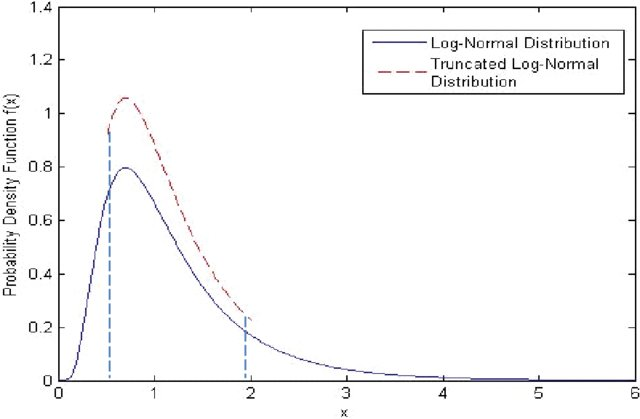
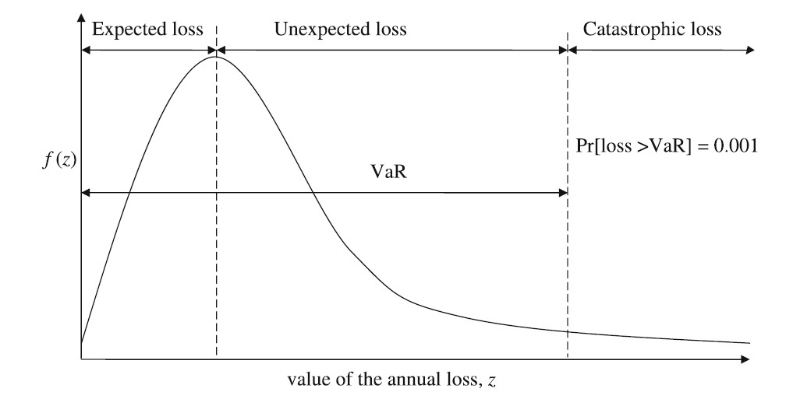

\newcommand{\WiD}{\operatorname{\text{Wi}}}
\newcommand{\WeD}{\operatorname{\text{We}}}
\newcommand{\WeNormD}{\operatorname{\text{We-N}}}
\newcommand{\ExpD}{\operatorname{\text{Exp}}}
\newcommand{\BeD}{\operatorname{\text{Be}}}
\newcommand{\GeoD}{\operatorname{\text{Geo}}}
\newcommand{\StD}{\operatorname{\text{St}}}
\newcommand{\NormD}{\operatorname{\text{N}}}
\newcommand{\GaD}{\operatorname{\text{Ga}}}
\newcommand{\UniD}{\operatorname{\text{U}}}
\newcommand{\DirD}{\operatorname{\text{Dir}}}
\newcommand{\IG}{\operatorname{\text{InG}}}
\newcommand{\IncGa}{\operatorname{\text{IGa}}}
\newcommand{\IGa}{\operatorname{\text{InGa}}}
\newcommand{\PoD}{\operatorname{\text{Po}}}
\newcommand{\BS}{\operatorname{\text{BS}}}
\newcommand{\DP}{\operatorname{\text{DP}}}
\newcommand{\BinD}{\operatorname{\text{Bin}}}
\newcommand{\BinNegD}{\operatorname{\text{BinNeg}}}
\newcommand{\dd}{\mathrm{d}}
\newcommand{\Indic}{\mathbb{I}}
\newcommand{\Borel}{\operatorname{\mathscr{B}}}
\newcommand{\Filtration}{\operatorname{\mathscr{F}}}
\newcommand{\Expec}{\operatorname{\mathbb{E}}}
\newcommand{\Var}{\operatorname{\text{var}}}


---

# Objetivos

Esta sesion esta dividida en dos partes:

`Parte 1` - Enfoques de agregacion de riesgos

`Parte 2` - Preliminares del aprendizaje estadistico en la agregacion de riesgos

Los temas claves de estas partes son:

* Estudiar las implicaciones de la `propiedad de separacion` en el proceso inferencia en distribuciones tipo mixtas.

* Incorporar `datos` en el proceso de aprendizaje.

* Incorporar `datos` e `informacion complementaria` en el proceso aprendizaje.

---

{\huge Parte 1}

---

# Enfoques de agregacion de riesgos

## Definicion

Los **modelos de agregacion de riesgos** son modelos estacasticos que miden la incertidumbre asociada con un portafolio de seguros.
	  	
Para esto, consideramos la siguiente notacion:

* $t$ es el indice asociado con los periods de operacion (de acuerdo con la actual regulacion, se consideran periodos equivalentes a 12 meses)

* $J_t$ se refiere a la suscripcion del portafolio de seguros en el periodo $t$

* $j$ es el indice asociado con las polizas suscritas en el periodo $t$, i.e. $j=1,\ldots,J_t$

* $Y_{tj}$ se refiere a la variable aleatoria que mide el monto de siniestro asociado con la poliza $j$ en el periodo de operacion $t$

* $X_{tj}$ corresponde al monto de reclamo del siniestro $Y_{tj}$ asociado con la poliza $j$ en el periodo $t$ (definido con base en las condiciones de la poliza)

* $D_{jt}$ es el monto del siniestro a cargo del asegurado en la poliza $j$ en el periodo $t$  (definido con base en las condiciones de la poliza)

* $Z_{jt}$ es el monto del siniestro a cargo de la reaseguradora  (definido con base en las condiciones de asministracion de riesgos agregados de la aseguradora)

De esta forma, conceptualmente, se cumple la disguiente identidad para cada poliza:
\begin{equation}
  \underbrace{Y_{tj}}_{\text{Siniestro}} 
    = \underbrace{D_{tj}}_{\text{Asegurado}} 
      + \underbrace{X_{tj}}_{\text{Aseguradora}} 
      + \underbrace{Z_{tj}}_{\text{Reaseguradora}},
\end{equation}
para $j=1,\ldots,J_t$.

Respecto a esta identidad, entender la exposicion al riesgo (**distribucion de probabilidad**) asociada con $Y_{tj}$ y $X_{tj}$ es de interes para comprender el riesgo (aseguradoras y reaseguradoras). Por otro lado, entender $D_{tj}$ es de interes para el aegurado.

Analizar la exposicion al riesgo, por separado para cada poliza, brinda de una sensibilidad acerca del riesgo inherente.

**Sin embargo**, por aspectos regulatorios y operativos, es necesario entender el expectro de riesgo asociado con la composicion del portafolio de $J_t$ polizas. Es decir, necesitamos entender el espectro del riesgos del agreado:
\begin{equation}
  \sum_{j=1}^{J_t} Y_{tj} 
    = \sum_{j=1}^{J_t}  D_{tj}
      + \sum_{j=1}^{J_t} X_{tj} 
      + \sum_{j=1}^{J_t} Z_{tj},
\end{equation}
es decir
\begin{equation}
  S^{Y}_{t} 
    = S^{D}_{t}
      + S^{X}_{t} 
      + S^{Z}_{t},
\end{equation}
donde

* $S^{Y}_{t}$ corresponde al *monto agregado de siniestros**

* $S^{D}_{t}$ corresponde al *monto agregado del siniestro absorbido por los asegurados**

* $S^{Y}_{t}$ corresponde al *monto agregado de reclamos**

* $S^{Y}_{t}$ corresponde al *monto agregado a cargo de la reaseguradora**

> Recordemos que al desconocimiento acerca de $S_t$ (en todos sus tipos), le subace el desconocimiento desagregado de sus componentes ($Y_{tj}$, $X_{tj}$, $D_{tj}$ o $Z_{tj}$), e.g.
$$
Y_{tj} \sim F_{Y_{tj}}(y),
$$
con una funcion de densidad (en su caso) de la siguiente forma.




> El desconocimiento acerca de cada componente $Y_{tj}$ (en su caso) se propaga al considerar el desconocimiento del agregado, $S^Y_{t}=\sum_{j=1}^{J_t}Y_{tj}$, de manera que 
$$
S^Y_{t}\sim F_{S^Y_t}(s) = \mathbb{P}\left(\sum_{j=1}^{J_t} Y_{tj} \leq s\right).
$$
Esta distribucion tiene asociada una densidad (en su caso) de la siguiente forma.





> El proposito de la modelacion de riesgos agregados es la de poder cuantificar la plausibilidad y nivel de los tres escenarios descritos en la figura anterior. En particular, por consideraciones regulatorias existentes, sera de interes entender la region III.

## Racionalidad

No todas las polizas en el portafolio experimentaran un siniestro (es el principio diversificacion del seguro). De esta forma, respecto a $Y_{tj}$ observamos que

* $Y_{tj} > 0$, en caso de que la poliza $j$ tenga un siniestro en $t$

* $Y_{tj} = 0$, en caso de que no experimente un siniestro en $t$.

De igual forma, podemos definir la siguiente descomposicion: 
\begin{eqnarray}
  \sum_{j=1}^{J_t} Y_{tj}
    & = & 
  \sum_{j|Y_{tj}=0} Y_{tj}
	 +
	 \sum_{j|Y_{tj}>0} Y_{tj}
	 \nonumber \\
	 & = & 
	 \sum_{j} Y_{tj} \Indic(Y_{tj}=0)
	 +
	 \sum_{j} Y_{tj} \Indic(Y_{tj}>0)
	 \nonumber \\
	 & = & 
	 \sum_{j}^{N_t} Y_{tj} \Indic(Y_{tj}>0),
\end{eqnarray}
donde,

* $N_t$ es el **numero/frecuencia de siniestros** en el periodo $t$

> Intrinsecamente, $N_t$ (antes de observarse) es incierto y aleatorio (desconocido).

> La magnitud individual del siniestro, $Y_{tj} \Indic(Y_{tj}>0)$ (antes de observarse) es incierta y aleatoria tambien, asi como la ocurrencia de siniestro, $\Indic(Y_j>0)$.

## Ejemplo

Consideremos que las polizas del portafolio son $iid$ y que cada poliza puede siniestrarse a lo mas una vez en $t$. De esta manera podemos definir $\iota_{tj}$ como la variable aleatoria,
\begin{eqnarray}
\iota_{tj} 
  & = & 
  \begin{cases}
  1, & Y_{tj} > 0, \\
  0, & Y_{tj} = 0, \\
  \end{cases}
  \nonumber \\
  & = & 
  \begin{cases}
  1, & j \text{ tiene siniestro en }t, \\
  0, & j \text{ no tiene siniestro en }t. \\
  \end{cases}
  \nonumber \\
\end{eqnarray}

> De esta forma, la **frecuencia de siniestres** (numero de siniestros en el portafolio) se calcula como
$$
N_t = \sum_{j=1}^{J_tj} \iota_{tj},
$$
siendo intrinsecamente desconocida/aleatoria.

## Agregaci\'on

De manera analoga, el **monto agregado de siniestros**, en el periodo $t$, se puede definir complementariamente como: 

\begin{eqnarray}
S^Y_t 
  & = &
  \sum_{j}^{N_t} Y_{tj} \mathbb{I}(Y_{tj}>0)
  \nonumber \\
  & = &
  \sum_{j}^{N_t} Y_{tj} \mathbb{I}(\iota_{tj}=1).
  \nonumber \\
\end{eqnarray}

Asi, quedan exhibidas las dos variables que explican la variablidad/incertidumbre respecto a $S^Y_{t}$, i.e.

*  $N_t$ - la frecuencia de siniestros

* $Y_{tj}$ - la severidad individual de siniestros

> Lo mismo aplica para los otros componentes de la agregacion.

## Dos enfoques de agreacion

### Riesgo individual

En este enfoque, el monto agregado de siniestro (o reclamo), $S^Y_t$ toma en cuenta la siguiente consideracion:

1. El numero de sumandos (suscripcion total), $J_t$, es considerado como fijo en riesgo operacional (mas no en riesgo de mercado),

2. La severidad individual considera la posibilidad de no tener siniestro y tener siniestro, i.e. el soporte de esta variable queda definido como
$$
Y_{tj} \in \mathcal{Y} = \{0\}\cup (0,\infty),
$$
el cual considera los escenarios donde $\iota_{tj}=0$ y $\iota_{tj}=1$.

> En este caso, la distribucion de severidades individuales $F_Y(y)$ sera del tipo mixta. En la `Parte 2` extudiaremos esto.

En este enfoque, el monto agregado, en este caso, se define como
$$
S_t = \sum_{j=1}^{J_t} (0\cdot \mathbb{I}(\iota_{tj}=0 + Y_{tj}\cdot \mathbb{I}(\iota_{tj}=1)).
$$

### Riesgo colectivo

Bajo este enfoque, el monto agregado de siniestro, $S^Y_t$ contempla:

1. El numero de sumandos (frecuencia siniestros), $N_t$, es desconocido/aleatorio,

2. Las severidades individuales tiene un suporte mas cimple, 
$$Y_{tj} \in \mathcal{Y} = (0,\infty),
$$
la cual sigue siendo considerada aleatoria/desconocida, **condicional** en 
$$
\iota_{tj}=1,
$$ 
tambien como desconocida/aleatoria, para todo $j=1,\ldots,J$.

En este enfoque, el monto agregado se define como
$$
S_t = \sum_{j=1}^{N_t} Y_{tj}\cdot \mathbb{I}(\iota_{tj}=1).
$$

---

{\HUGE Parte 2}

---

# Aprendizaje Estadistico

## Preambulo

Seguimos considerando la clase de modelos tipo mixto con soporte en 
$$
\mathcal{X}=\{0\}\cup (0,\infty),
$$
con funcion de "densidad" dada por 
$$
f(x|\theta_0,\theta_c)=\theta_0 \mathbb{I}(x=0)+(1-\theta_0)\theta_c\exp\{-\theta_c x\}\mathbb{I}(x>0),
$$
donde 

* $\theta_0\in (0,1)$ corresponde al parametro con $\mathbb{P}(\iota_{tj}=0)$, y

* $\theta_c \in \mathbb{R}_+$ corresponde al componente $F_X(x|\iota=1)$.

Es decir, lo anterior puede considerar una composicion considerando la variable auxiliar
$$
\iota
 =
 \begin{cases}
1, \text{ si } x=0 \text{, con probabilidad } \theta_0,\\
0, \text{ si } x>0 \text{, con probabilidad } (1-\theta_0).\\
\end{cases}
$$

## Problema inferencial

Si consideramos un conjunto de `datos` dado por una coleccion de $J$ observaciones/polizas que toman valores en $\mathcal{X}$, digamos
$$
\text{datos}=\{x_1,\ldots,x_J\},
$$
tendremos el **objetivo** de encontrar los valores de 
$$
\theta_0\text{ y }\theta_c,
$$
que **sean mas compatibles con los datos**.

> \textcolor{blue}{Recordemos que como $x_i\in\mathcal{X}$, esperaremos que varios $x_i$s compartan el valor $0$ (el atomo en no siniestro).}

## Datos

Consideremos los datos reales de la empresa **AllState** de un portafolio de seguros de autos. 

Cargamos los datos desde un repositorio en GitHUb (en este caso, el repositorio de datos de nuestro curso, referido como `JCMO-ITAM/Data4Analysis`). Para esto, empleamos en RStudio el paquete `repmis`. El diccionario de datos se encuentra en el mismo repositorio.

```
if(!require("repmis")){install.packages("repmis")}
library("repmis")

data <- source_data("https://github.com/JCMO-ITAM/Data4Analysis/...
        blob/master/d4a_allstateclaim_data.csv?raw=true")
```

## Resumen

Los `datos` incluyen las siguientes variables:

```{r dataload, echo=FALSE}
if(!require("repmis")){install.packages("repmis")}
library("repmis")

data <- source_data("https://github.com/JCMO-ITAM/Data4Analysis/blob/master/d4a_allstateclaim_data.csv?raw=true")

data <- as.data.frame(data)
colnames(data)
data <- data[which(data$Calendar_Year==2005),]
```

La variable `Claim_Amount` representa el monto de reclamo individual, nuestros valores $x_i$.

Los casos `Claim_Amount==0` representan no siniestro en la poliza correspondiente. 

$J$ es el numero de polizas en los `datos`, y $n$ es el numero de polizas con no siniestro.

```{r summary1, echo=FALSE}
J <- nrow(data)
n0 <- nrow(as.matrix(which(data$Claim_Amount==0)))
J;n0
```

## Verosimilitud

La funcion de verosimilitud para $(\theta_0,\theta_c)$ con base en los datos es (bajo el supuesto `iid`),
\begin{eqnarray}
lik(\theta_0,\theta_c|\text{datos}) 
& = &
\prod_{i=1}^{J}f(x_i|\theta_0,\theta_c) \nonumber \\
& = &
\prod_{x_i:x_i=1}^{J}\theta_0 \times \prod_{x_i:x_i>0}(1-\theta_0)\theta_c\exp\{-\theta_c x_i\} \nonumber \\
& = &
\theta_0^{n_0} \times (1-\theta_0)^{J-n_0}\theta_c^{J-n_0}\exp\{-\theta_c \sum_{x_i:x_i>0}x_i\}, \nonumber
\end{eqnarray}
donde 
$$
n_0=\#\{ x_i: x_i=0\}.
$$

## Comentarios

1. Noten que el componente $$\theta_0^{n_0} \times (1-\theta_0)^{J-n_0},$$ resume la informacion en los datos para $\theta_0$.

2. Noten que el componente $$\theta_c^{J-n_0}\exp\left\{-\theta_c \sum_{x_i:x_i>0}x_i\right\},$$ resume la informacion para $\theta_c$.

3. Ambas partes son `separadas` pero `no ajenas`. Por esto, podemos hacer inferencia sobre $\theta_0$ y $\theta_c$ por `separado`.

> Esto manifiesta la propiedad de separabilidad en el modelo.

## Maxima verosimilitud I

Encontrar el EMV para $\theta_0$ con base en los `datos` es relativamente simple, ya que por la condicion de separabilidad este es dado por
\begin{eqnarray}
  \theta_0^{*}
  & = &
  \arg\max_{(0,1)} \theta_0^{n_0} \times (1-\theta_0)^{J-n_0} \nonumber \\
  & = &
  \frac{n_0}{J}. \nonumber
\end{eqnarray}

En el caso de los datos **AllState**, este se calcula como
```{r}
theta0_star <- n0/J
theta0_star
```

El **error epistemico** asociado con el EMV es de la siguiente forma:

```{r likelihhod, echo=FALSE}
theta0 <- seq(.001, .999, .001)
lik_theta0 <- dbeta(theta0, 1 + n0, 1 + (J-n0) )

plot(theta0, lik_theta0, xlim=c(0,1), ylim=c(0, 1.25 * max(lik_theta0,1.6)), 
     type = "l", ylab= "Verosimilitud", lty = 3,
     xlab= "theta_0", las=1, main="",lwd=2,
     cex.lab=1.5, cex.main=1.5, col = "darkorange", axes=FALSE)
axis(1, at = seq(0,1,.2)) #adds custom x axis
axis(2, las=1) # custom y axis
```

Aunque parece que este error es nulo, aun subyace solo que de manera ma acotada:

```
{r likelihhod, echo=FALSE}
theta0 <- seq(.99, .999, .0001)
lik_theta0 <- dbeta(theta0, 1 + n0, 1 + (J-n0) )

plot(theta0, lik_theta0, xlim=c(.99,1), ylim=c(0, 1.25 * max(lik_theta0,1.6)), 
     type = "l", ylab= "Verosimilitud", lty = 3,
     xlab= "theta_0", las=1, main="",lwd=2,
     cex.lab=1.5, cex.main=1.5, col = "darkorange", axes=FALSE)
axis(1, at = seq(0,1,.2)) #adds custom x axis
axis(2, las=1) # custom y axis
```


### Reflexion

* Aunque pareciera ser contundente, es conveniente considerar solamente la informacion de estos "datos"? 

## Licitacion con informacion complementaria

Pensemos ahora en el caso en que informacion complementaria acerca de la incidencia de siniestralidad esta disponible como:

* (A). Creemos que la mediana de la incidencia de siniestros es $0.85$.

* (B). Creemos que el $99.999$-esimo porcentil de la incidencia de siniestros es $0.95$.

* (C). Creemos que el porcentil $0.001$ de la incidencia de siniestros es $0.60$.

Es decir, en `R` definimos esta informacion en la forma de cuantiles:

```{r infocompl, include=TRUE}
quantile1 <- list(p=0.5, x=0.85)    # Complemento A
quantile2 <- list(p=0.99999,x=0.95) # Complemento B
quantile3 <- list(p=0.00001,x=0.60) # Complemento C
```

> Esta informacion complementaria resume la informacion de expertos / instituciones reguladoras / mercado / etc.

El proceso de **licitacion con informacion complementaria** consiste en encontrar una distribucion $$\pi(\theta_0),$$ con soporte en $(0,1)$ tal que los cuantiles bajo $\pi(\cdot)$ sean compatibles (lo mas posible) con los cuantiles definidos por (A)-(C).

> Noten que generalmente esta compatibilidad no sera exacta, siendo el procedimiento de licitacion referido a un proceso de interpolacion de distribuciones.

> La licitacion en `R` para este caso se relaiza con la funcion `beta.elicitacion(quantile1,quantile2,quantile3)` (vean el codigo fuente en el archivo `markdown` de esta sesion).

```{r infocompl_code, include=FALSE}
beta.elicitacion <- function(quantile1,quantile2,quantile3){
  quantile1_p <- quantile1[[1]]; quantile1_q <- quantile1[[2]]
  quantile2_p <- quantile2[[1]]; quantile2_q <- quantile2[[2]]
  quantile3_p <- quantile3[[1]]; quantile3_q <- quantile3[[2]]
  
  priorA <- beta.select(quantile1,quantile2)
  priorA_a <- priorA[1]; priorA_b <- priorA[2]
  
  priorB <- beta.select(quantile1,quantile3)
  priorB_a <- priorB[1]; priorB_b <- priorB[2]
  
  diff_a <- abs(priorA_a - priorB_a); diff_b <- abs(priorB_b - priorB_b)
  step_a <- diff_a / 100; step_b <- diff_b / 100
  if (priorA_a < priorB_a) { start_a <- priorA_a; end_a <- priorB_a }
  else                     { start_a <- priorB_a; end_a <- priorA_a }
  if (priorA_b < priorB_b) { start_b <- priorA_b; end_b <- priorB_b }
  else                     { start_b <- priorB_b; end_b <- priorA_b }
  steps_a <- seq(from=start_a, to=end_a, length.out=1000)
  steps_b <- seq(from=start_b, to=end_b, length.out=1000)
  max_error <- 10000000000000000000
  best_a <- 0; best_b <- 0
  for (a in steps_a)
  {
    for (b in steps_b)
    {
      priorC_q1 <- qbeta(c(quantile1_p), a, b)
      priorC_q2 <- qbeta(c(quantile2_p), a, b)
      priorC_q3 <- qbeta(c(quantile3_p), a, b)
      priorC_error <- abs(priorC_q1-quantile1_q) +
        abs(priorC_q2-quantile2_q) +
        abs(priorC_q3-quantile3_q)
      if (priorC_error < max_error)
      {
        max_error <- priorC_error; best_a <- a; best_b <- b
      }
    }
  }
  print(paste("Elicitacion para a=",best_a,"b=",best_b))
  }


if(!require("LearnBayes")){install.packages("LearnBayes")}
library("LearnBayes")
```

En este caso practico, la distribucion licitada es
$$
\pi(\theta_0) = \BeD(\theta_0|52.22, \ 9.52).
$$
```{r betaelicitacion, echo=FALSE}
beta.elicitacion(quantile1,quantile2,quantile3)

curve(dbeta(x,52.22,9.52105105105105))
```

## Aprendizaje bayesiano

La informacion contenida en los `datos` y `complementaria` se **consolida** en la siguiente expresion
$$
q(\theta_0|\text{datos},\text{complemento}) \propto lik(\theta_0|\text{datos}) \times q(\theta_0|\text{complemento}).
$$

Resulta ser que si $q(\theta_0|\text{complemento})$ es una medida de probabilidad, la funcion $q(\theta_0|\text{datos},\text{complemento})$ tambien lo es (como lo vimos en la sesion pasada).

> En este caso, tal condicion se cumple, pues $q(\theta_0|\text{complemento})$ se licito siendo parte de la familia de distribuciones beta. 

La funcion $q(\theta_0|\text{complemento})$ se refiere a la **prior** del modelo en el contexto bayesiano de inferencia.

```{r consolidadcion_code, include=TRUE}
consolidacion.binomialbeta <- function(successes, total, a, b, print=TRUE,summary=TRUE){
  likelihood_a = successes + 1; likelihood_b = total - successes + 1
  posterior_a = a + successes;  posterior_b = b + total - successes
  theta = seq(0.005, 0.995, length = 500)
  prior = dbeta(theta, a, b)
  likelihood = dbeta(theta, likelihood_a, likelihood_b)
  posterior  = dbeta(theta, posterior_a, posterior_b)
  m = max(c(prior, likelihood, posterior))
  if(print==TRUE){
    plot(theta, posterior, type = "l", ylab = "Density", lty = 2, lwd = 3,
       main = paste("beta(", a, ",", b, ") prior, B(", total, ",", successes, ") data,",
                    "beta(", posterior_a, ",", posterior_b, ") posterior"), ylim = c(0, m), col = "red")
    lines(theta, likelihood, lty = 1, lwd = 3, col = "blue")
    lines(theta, prior, lty = 3, lwd = 3, col = "green")
    legend(x=0.8,y=m, c("Prior", "Likelihood", "Posterior"), lty = c(3, 1, 2),
         lwd = c(3, 3, 3), col = c("green", "blue", "red"))
  }
  if(summary==TRUE){
  calcBetaMode <- function(aa, bb) { BetaMode <- (aa - 1)/(aa + bb - 2); return(BetaMode); }
  calcBetaMean <- function(aa, bb) { BetaMean <- (aa)/(aa + bb); return(BetaMean); }
  calcBetaSd   <- function(aa, bb) { BetaSd <- sqrt((aa * bb)/(((aa + bb)^2) * (aa + bb + 1))); return(BetaSd); }
  prior_mode      <- calcBetaMode(a, b)
  likelihood_mode <- calcBetaMode(likelihood_a, likelihood_b)
  posterior_mode  <- calcBetaMode(posterior_a, posterior_b)
  prior_mean      <- calcBetaMean(a, b)
  likelihood_mean <- calcBetaMean(likelihood_a, likelihood_b)
  posterior_mean  <- calcBetaMean(posterior_a, posterior_b)
  prior_sd        <- calcBetaSd(a, b)
  likelihood_sd   <- calcBetaSd(likelihood_a, likelihood_b)
  posterior_sd    <- calcBetaSd(posterior_a, posterior_b)
  print(paste("Modas=",prior_mode," | ",likelihood_mode," | ",posterior_mode))
  print(paste("Medias=",prior_mean," | ",likelihood_mean," | ",posterior_mean))
  print(paste("sd s=",prior_sd," | ",likelihood_sd," | ",posterior_sd))
  }
}
```

```{r}
consolidacion.binomialbeta(n0, J, 52.22, 9.52,print=TRUE,summary=FALSE)
```

La segunda interpretacion del **error epistemico** (bajo el enfoque bayesiano), queda resumido en la distribucion final:

```{r}
consolidacion.binomialbeta(n0, J, 52.22, 9.52,print=FALSE,summary=TRUE)
```

# Ejercicio

1. Seleccionen una submuestra aleatoria del 10\% de los `datos`.

2. Repliquen los calculos usando los datos de la submuestra aleatoria.

3. Reflexione acerca de los **estimadores puntuales**, el **error epistemico** y relevancia de la **informacion complementaria**.

4. Calculen la distribucion predictiva de incidencia en siniestralidad para $\iota$s.

5. Calculen la distribucion predictiva de **frecuencia de siniestros** para $N$.

Completen estas cinca actividades en un archivo `markdown` distinto.
