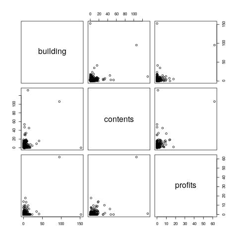
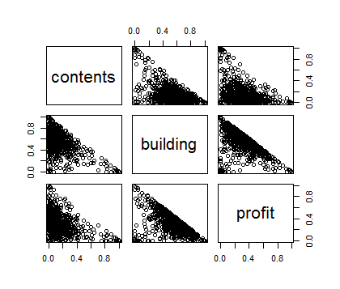
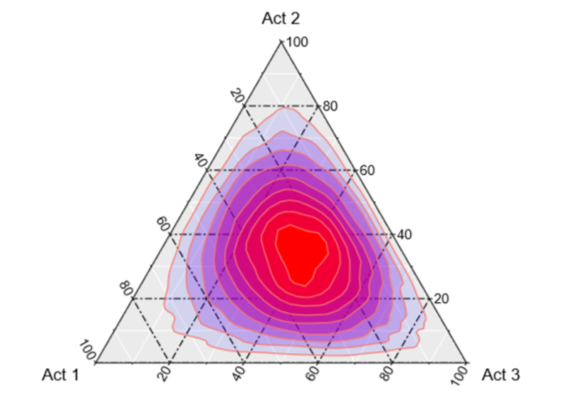
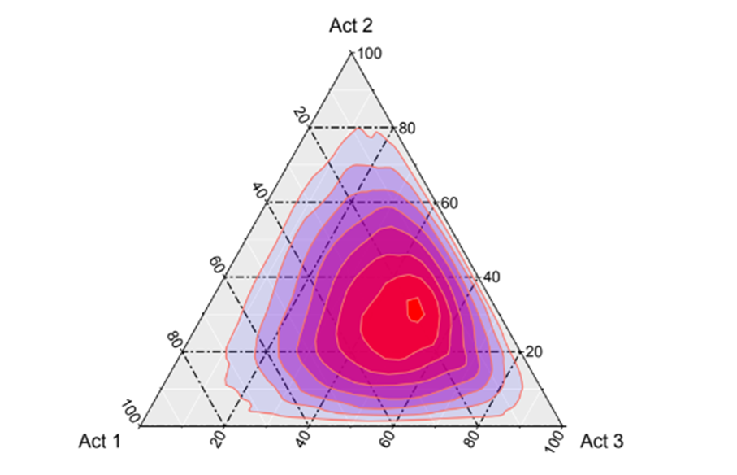
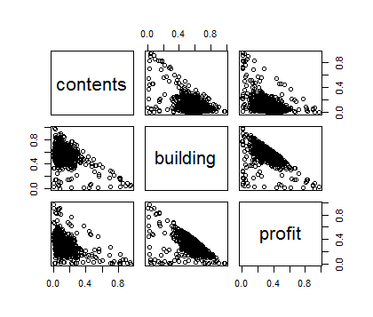
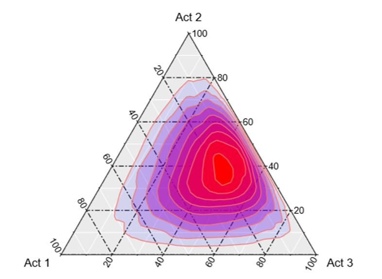

<<<<<<< HEAD
---
title: "Session 16 - Construction of reinsurance portfolios"
author:
-  Juan Carlos Martínez-Ovando
date: "Otoño 2019"
output:
  html_document:
    toc: true
    toc_float: true
    toc_depth: 3
    number_sections: yes
    self_contained: yes
    theme: cerulean # cosmo
    highlight: textmate
fig_align: "center"
fig_width: 18

header-includes:
    - \usepackage[most]{tcolorbox}
    - \usepackage{mathtools}
    - \definecolor{light-yellow}{rgb}{1, 0.95, 0.7}
    - \newtcolorbox{myquote}{colback=light-yellow,grow to right by=-10mm,grow to left by=-10mm, boxrule=0pt,boxsep=0pt,breakable}
    - \newcommand{\todo}[1]{\begin{myquote} \textbf{TODO:} \emph{#1} \end{myquote}}

---

\newcommand{\WiD}{\operatorname{\text{Wi}}}
\newcommand{\WeD}{\operatorname{\text{We}}}
\newcommand{\WeNormD}{\operatorname{\text{We-N}}}
\newcommand{\ExpD}{\operatorname{\text{Exp}}}
\newcommand{\BeD}{\operatorname{\text{Be}}}
\newcommand{\GeoD}{\operatorname{\text{Geo}}}
\newcommand{\StD}{\operatorname{\text{St}}}
\newcommand{\NormD}{\operatorname{\text{N}}}
\newcommand{\GaD}{\operatorname{\text{Ga}}}
\newcommand{\UniD}{\operatorname{\text{U}}}
\newcommand{\DirD}{\operatorname{\text{Dir}}}
\newcommand{\IG}{\operatorname{\text{InG}}}
\newcommand{\IncGa}{\operatorname{\text{IGa}}}
\newcommand{\IGa}{\operatorname{\text{InGa}}}
\newcommand{\PoD}{\operatorname{\text{Po}}}
\newcommand{\BS}{\operatorname{\text{BS}}}
\newcommand{\DP}{\operatorname{\text{DP}}}
\newcommand{\BinD}{\operatorname{\text{Bin}}}
\newcommand{\BinNegD}{\operatorname{\text{BinNeg}}}
\newcommand{\dd}{\mathrm{d}}
\newcommand{\Indic}{\mathbb{I}}
\newcommand{\Borel}{\operatorname{\mathscr{B}}}
\newcommand{\Filtration}{\operatorname{\mathscr{F}}}
\newcommand{\Expec}{\operatorname{\mathbb{E}}}
\newcommand{\Var}{\operatorname{\text{var}}}


```{r setup, include=FALSE}
knitr::opts_chunk$set(echo = TRUE)
```

# Preliminaries {.tabset .tabset-fade .tabset-pills}

The construction of *proportional risk portfolios* has played a fundamental role in financial and actuarial theory and practice. In finance, this theory is related to the work of Markowitz (1959), while in actuarial sciences the work of de Finetti (1940) has been fundamental.

> Both financial and actuarial problems have a common mathematical aspect, quadratic optimization procedures under a stochastic modeling approach based on variance.

## Proportional reinsurance

Lets assume an insurance company pays attention to $L$ sub-portfolios of different risks. Each of these types of risks is accompanied by a *risk premium*, $\Pi_l$, and an unknown *claim amount*, $S_l$, so that the **net profit** for each type of risk is define as
$$
R_l = \Pi_l - S_l.
$$
According to this definition, $R_l$ take values on the real line, for $l=1,\ldots,L$.

**Note:** From now on, the mathematical construction that we will study could be applied analogously to the problem of optimization of investment portfolios, considering that $R_l$ represents the returns of a risk asset $l$.

In the previous way, the **net profit** vector of the portfolio compossed by the $L$ risks is denoted by,
$$
\boldsymbol{R} = \left(R_1,\ldots,R_L\right).
$$
Assuming that
$$
\boldsymbol{R}\sim F(r|\mu,\Sigma),$$
is a $L$-dimensional distribution function, where
\begin{eqnarray}
\mu & = & \mathbb{E}_F(\boldsymbol{R}_t), \\
\Sigma & = & var_F(\boldsymbol{R}_t).
\end{eqnarray}

## The problem

As insurers, we must choose a *proportional reinsurance strategy* (or, a *retention strategy*), specified by the $L$-dimensional vector,
$$
(\alpha_1,\ldots,\alpha_L),
$$
so that each component $\alpha_l$ represents the *proportion* of the risk associated with type $l$ that will be retained by the insurer, i.e.
\begin{eqnarray}
\alpha_l & > &0,\text{ for }l=1,\ldots,L \\
\sum_{l=1}^{L} \alpha_l & = &1.
\end{eqnarray}

De esta forma, los niveles de retencion $\alpha_l$s inducen un nivel agregado de **ganancias netas retenidas**, $R(\alpha)$, donde
$$
R(\alpha) = \boldsymbol{R}'\boldsymbol{\alpha},
$$
with,
\begin{eqnarray}
\mathbb{E}_F\left(R(\alpha)\right) & = & \mu'\boldsymbol{\alpha} \\  
var_F\left(R(\alpha)\right) & = & \boldsymbol{\alpha}' \Sigma \boldsymbol{\alpha}.
\end{eqnarray}

> The **problem** consists in choosing the retention vector **properly** $\boldsymbol{\alpha}$, according to some optimality criteria.

## de Finetti/Markowitz solution

> de Finetti and Markowitz proposed an optimality criterion to choose $\boldsymbol{\alpha}$, which as of the date, it is known as the `mean-variance criterion`.

This criterion is a rough way to choose $\boldsymbol{\alpha}$ so that it *maximizes the expected return of the portfolio,* i.e. the **optimal choice** corresponds to the optimization problem in which
$$
\min \frac{1}{2} \boldsymbol{\alpha}' \Sigma \boldsymbol{\alpha},\\
\text{s.a. } \mu'\boldsymbol{\alpha} > e, \\
$$
for a given predefined $e$ threshold, with $\boldsymbol{\alpha}$ chosen within the $(L-1)$-dimensional simplex.

The standard solution of this problem is obtained analogously using the Lagrange method, where
$$
\boldsymbol{\alpha}^* = \min_{\boldsymbol{\alpha}} \frac{1}{2} \boldsymbol{w}' \Sigma \boldsymbol{\alpha} + 
\lambda\left(e - \mu'\boldsymbol{\alpha}\right) + \boldsymbol{u}'(\boldsymbol{\alpha}-1)-\boldsymbol{v}'\boldsymbol{\alpha},
$$
where $\lambda$ is the Lagrange coefficient (with $\lambda>0$), and $\boldsymbol{u} ,\boldsymbol{v}$ being positive $L$-dimensional vectors.

# Frameworks  {.tabset .tabset-fade .tabset-pills}

## Utility maximization

Allocation is defined as the solution to a decision theory problem,
$$
\alpha^{*}
	    =
	    \arg\max_{\alpha \in \mathcal{S}_{p-1}}
	    \mathbb{E}_{\mathbb{P}} \left\{U(\alpha,\boldsymbol{R})\right\}
$$
where

* $\mathcal{S}_{p-1}$ -- decision space

* $\mathcal{R}$ -- uncertainty space 

* $\mathbb{P}$ -- probability measure for $\boldsymbol{R}$

* $U(\cdot,\cdot)$ -- subjective preferences (utility or loss functions)

  - Analogamente, podemos expresar el problema como *optimizacion por minimizacion* cuando $U(\cdot,\cdot)$ se sustituya por una funcion de perdida, $L(\cdot,\cdot)$.
  
## *Mean-Variance*

Approach proposed by de~Finetti (1940) and Markowitz (1952)

$$
\alpha^{*}
	  =
	  \arg\max_{\alpha \in \mathcal{S}_{p-1}}
	  \left\{
	  \alpha'\mathbb{E}_{\mathbb{P}}\left(\boldsymbol{R}\right)
	  - \frac{\lambda}{2} \alpha'var_{\mathbb{P}}\left(\boldsymbol{R}\right)\alpha 
	  \right\}.
$$	

**Remarks**

* $\lambda$ is the underlying {\it risk aversion} coefficient

* $\rho(\alpha,\boldsymbol{R})=\alpha'var_{\mathbb{P}}\left(\boldsymbol{R}\right)\alpha$ -- risk measure

**Comments**

* This framework is based on arguments such as *dispersion* and *co-movement*
		
* Extensions to cover *bias* in the portfolio are allowed
		
* Loss function and probability measure are restricted to elliptical countours

* Desirable to include considerations based on *extreme losses* --or *extreme gains* in finance--

## Risk measures

**Value-at-risk**

> Value-at-risk ($VaR$) is the value of the portfolio that characterizes {\it extremes losses} or {\it extreme gains} at a probability level $0<q<1$, i.e.


$$
VaR_{\alpha,q} 
		\ \ \text{s.t.} \ \
		\mathbb{P}_{\alpha}\left(
		C > VaR_{\alpha,q} 
		\right) = 1-q  
		\nonumber
$$

where 

* $\mathbb{P}_{\alpha}$ - distribution for $C$ induced by $\mathbb{P}$ and $\alpha$

* $\mathbb{P}$ - component uncertainty in the portfolio

* $\alpha$ - portfolio allocation

**Expected shortfall**


> Expected shortfall at level $p$ ($ES_q$) is the expected value of the portfolio in excess of  $VaR_q$, i.e.

$$
  ES_{\alpha,q} = \frac{1}{1-q}
	   \int_{VaR_{\alpha,q}}^{\infty} 
	   c \mathbb{P}_{\alpha}(c|c>VaR_q) d c
$$
where 

* $\mathbb{P}_{\alpha}$ - probability measure for $C$ induced by $\mathbb{P}$ and $\alpha$

* $\mathbb{P}$ - component uncertainty 

* $\alpha$ - portfolio allocations

## Portfolio allocation based on $ES$

Defining the shares $\alpha$ such that for a level $0<q<1$ the losses in excess of $VaR_q$ are minimal (Goldberg et al, 2017), i.e.
\begin{eqnarray}
	\alpha^{*}
	  & = &
	 \arg \min_{\alpha \in S_{p-1}}
	 \left\{
	 ES_{\alpha,q} - 
	 \frac{\lambda}{2}K\left(\alpha,\boldsymbol{R}\right)
	 \right\}
	 \nonumber \\
	 & = &
	 \arg \min_{\alpha \in S_{p-1}} \left\{
	 \frac{1}{1-q}\int_{VaR_{\alpha,q}}^{\infty} 
	 c \mathbb{P}_{\alpha}(c|c>VaR_q) d c	  
	 - \frac{\lambda}{2}
	 K\left(\alpha,\boldsymbol{R}\right)
	 \right\}.
\end{eqnarray}

**Comments**

* Direct optimization is not trivial

* Stochastic optimization is required to introduce {\it intrinsic} and {\it epistemic} uncertainty

## Predictive portfolio allocation

Based on past observations, we compute (from a Bayesian perspective)
$$
		\mathbb{P}(\boldsymbol{R}_{n+1}|\boldsymbol{r}_1,\ldots,\boldsymbol{r}_n)=\int \underbrace{F(\boldsymbol{R}_{n+1})}_{\text{Intrinsic}} \underbrace{\Pi(d F|\boldsymbol{r}_1,\ldots,\boldsymbol{r}_n)}_{\text{Epistemic}},
$$		
as flexible as possible, where

* $\boldsymbol{r}_i=(r_{i,1},\ldots,r_{i,p})$ for $i=1,\ldots,n$

* $\boldsymbol{R}_{n+1}=(R_{n+1,1},\ldots,R_{n+1,p})$


---
---

Based on $\mathbb{P}(\boldsymbol{R}_{n+1}|\boldsymbol{r}_1,\ldots,\boldsymbol{r}_n)$ simulate $M$ possible future  scenarios of portfolio components,
$$
		\left(r_{n+1,1}^{(m)},\ldots,r_{n+1,p}^{(m)}\right)_{m=1}^{M}.
$$ 
	
**Remarks:**

* For $M$ large enough $ES$ can be approximated using importance sampling

* We also use *modified distributions* based on the choice of $\lambda$

# Empirical results  {.tabset .tabset-fade .tabset-pills}

## Datos

En esta seccion, ilustramos el procedimiento de seleccion de carteras de reaseguro con los datos *Business building insurance* (McNeil et al, 2005). En particular, consideramos

* `building `-- Act1, 

* `contents` -- Act2, 

* `profits` -- Act3.



## Bayesian nonparametrics

El modelo de probabilidad empleado en este caso es (Walker and Stephens, 1999)
$$
\mathbb{P}(r_{i}) 
 =
 \sum_{k=1}^{\infty} w_k p(r_{i}|u_k)
$$
donde
\begin{eqnarray}
	p\left(\left\{w_k,u_k \right\}_{k=1}^{\infty}\right) 
	  & = & 
	  \text{SB}\left( 
	  \left\{w_k\right\}_{k=1}^{\infty}
	  \right)
	  \times
	  \prod_{k=1}^{\infty}\NormD(u_k|\mu,\Sigma)
	  \nonumber \\
	p(r_{i}|u_k) 
	  & = & 
	  \left\{
	  \prod_{j=1}^{p}
	  a_j x_{i}^{a_j - 1} 
	  \right\}
	  \exp\left\{-\sum_{j=1}^{p}a_j u_j\right\}
	  \mathbb{I}\left(r_{i} < \exp\{u_k\}\right)
	  \nonumber
	\end{eqnarray}

## Especificaciones

* Mean distribution for $r_i$ is multivariate beta-log-normal
		 
* Marginal distributions for $r_{ij}$ are beta-log-normales
		 
* Limit case when $a_k \rightarrow \infty$ is log-normal distribution (for marginales)
		 
* Includes three separable parameters for *bias*, *location* and *dispersion* 	

## Prior distribution

\begin{eqnarray}
	p(a_1,\ldots,a_p)
	  & = &
	  \prod_{j=1}^{p} \GaD(a_j|c_0.d_0)
	  \nonumber \\
	p(\mu)
	  & = &
	  \NormD(\mu|m_0,S_0)
	  \nonumber \\
	p(\Sigma)
	  & = &
	  \text{WishInvD}(\Sigma|e_0,C_0)
	  \nonumber
\end{eqnarray}

## Algorithm

The *Gibbs sampler*:

* $a$ -- not closed form, uses multivariate slice sampler

* $\mu$ -- conjugate normal

* $\Sigma$ -- conjugate inverse Wishart

* $w_k$s -- posterior multinomial (under latent truncation)

* $u_k$s -- multivariate truncated normals

* $r_{n+1}^{(m)}$s - weighted important sampling

* $\alpha$ -- not closed form, uses multivariate slice sampler under reparametrization

## Sensitivity under scenario 1






## Sensitivity under scenario 2




## Sensitivity under scenario 3





# Supplementary readings

* de Finetti, B (1940) "Il problema dei “Pieni”. Giornale dell" * *Instituto Italiano degli Attuari* 11, 1–88.  Trasnlation to English: (Barone, L. (2006)) "The problem of full-risk insurances." Chapter I. "The risk within a single accounting period." *Journal of Investment Management* 4(3), 19–43

* Markowitz, H. (1959) *Portfolio selection: efficient diversification of investments.* New York: John Wiley & Sons.

* Martinez-Ovando, J.C. (2018) *Portfolio Allocation Strategies: A Bayesian ES Perspective in Reinsurance.* Submitted.

* Rubinstein M. (2006a) "Bruno de Finetti and mean-variance portfolio selection." *Journal of Investment Management* 4(3), 3–4.

* Rubinstein M. (2006b) "A history of the theory of investments." Wiley, Hoboken, NJ.
=======
---
title: "Session 16 - Construction of reinsurance portfolios"
author:
-  Juan Carlos Martínez-Ovando
date: "Otoño 2019"
output:
  html_document:
    toc: true
    toc_float: true
    toc_depth: 3
    number_sections: yes
    self_contained: yes
    theme: cerulean # cosmo
    highlight: textmate
fig_align: "center"
fig_width: 18

header-includes:
    - \usepackage[most]{tcolorbox}
    - \usepackage{mathtools}
    - \definecolor{light-yellow}{rgb}{1, 0.95, 0.7}
    - \newtcolorbox{myquote}{colback=light-yellow,grow to right by=-10mm,grow to left by=-10mm, boxrule=0pt,boxsep=0pt,breakable}
    - \newcommand{\todo}[1]{\begin{myquote} \textbf{TODO:} \emph{#1} \end{myquote}}

---

\newcommand{\WiD}{\operatorname{\text{Wi}}}
\newcommand{\WeD}{\operatorname{\text{We}}}
\newcommand{\WeNormD}{\operatorname{\text{We-N}}}
\newcommand{\ExpD}{\operatorname{\text{Exp}}}
\newcommand{\BeD}{\operatorname{\text{Be}}}
\newcommand{\GeoD}{\operatorname{\text{Geo}}}
\newcommand{\StD}{\operatorname{\text{St}}}
\newcommand{\NormD}{\operatorname{\text{N}}}
\newcommand{\GaD}{\operatorname{\text{Ga}}}
\newcommand{\UniD}{\operatorname{\text{U}}}
\newcommand{\DirD}{\operatorname{\text{Dir}}}
\newcommand{\IG}{\operatorname{\text{InG}}}
\newcommand{\IncGa}{\operatorname{\text{IGa}}}
\newcommand{\IGa}{\operatorname{\text{InGa}}}
\newcommand{\PoD}{\operatorname{\text{Po}}}
\newcommand{\BS}{\operatorname{\text{BS}}}
\newcommand{\DP}{\operatorname{\text{DP}}}
\newcommand{\BinD}{\operatorname{\text{Bin}}}
\newcommand{\BinNegD}{\operatorname{\text{BinNeg}}}
\newcommand{\dd}{\mathrm{d}}
\newcommand{\Indic}{\mathbb{I}}
\newcommand{\Borel}{\operatorname{\mathscr{B}}}
\newcommand{\Filtration}{\operatorname{\mathscr{F}}}
\newcommand{\Expec}{\operatorname{\mathbb{E}}}
\newcommand{\Var}{\operatorname{\text{var}}}


```{r setup, include=FALSE}
knitr::opts_chunk$set(echo = TRUE)
```

# Preliminaries {.tabset .tabset-fade .tabset-pills}

The construction of *proportional risk portfolios* has played a fundamental role in financial and actuarial theory and practice. In finance, this theory is related to the work of Markowitz (1959), while in actuarial sciences the work of de Finetti (1940) has been fundamental.

> Both financial and actuarial problems have a common mathematical aspect, quadratic optimization procedures under a stochastic modeling approach based on variance.

## Proportional reinsurance

Lets assume an insurance company pays attention to $L$ sub-portfolios of different risks. Each of these types of risks is accompanied by a *risk premium*, $\Pi_l$, and an unknown *claim amount*, $S_l$, so that the **net profit** for each type of risk is define as
$$
R_l = \Pi_l - S_l.
$$
According to this definition, $R_l$ take values on the real line, for $l=1,\ldots,L$.

**Note:** From now on, the mathematical construction that we will study could be applied analogously to the problem of optimization of investment portfolios, considering that $R_l$ represents the returns of a risk asset $l$.

In the previous way, the **net profit** vector of the portfolio compossed by the $L$ risks is denoted by,
$$
\boldsymbol{R} = \left(R_1,\ldots,R_L\right).
$$
Assuming that
$$
\boldsymbol{R}\sim F(r|\mu,\Sigma),$$
is a $L$-dimensional distribution function, where
\begin{eqnarray}
\mu & = & \mathbb{E}_F(\boldsymbol{R}_t), \\
\Sigma & = & var_F(\boldsymbol{R}_t).
\end{eqnarray}

## The problem

As insurers, we must choose a *proportional reinsurance strategy* (or, a *retention strategy*), specified by the $L$-dimensional vector,
$$
(\alpha_1,\ldots,\alpha_L),
$$
so that each component $\alpha_l$ represents the *proportion* of the risk associated with type $l$ that will be retained by the insurer, i.e.
\begin{eqnarray}
\alpha_l & > &0,\text{ for }l=1,\ldots,L \\
\sum_{l=1}^{L} \alpha_l & = &1.
\end{eqnarray}

De esta forma, los niveles de retencion $\alpha_l$s inducen un nivel agregado de **ganancias netas retenidas**, $R(\alpha)$, donde
$$
R(\alpha) = \boldsymbol{R}'\boldsymbol{\alpha},
$$
with,
\begin{eqnarray}
\mathbb{E}_F\left(R(w)\right) & = & \mu'\boldsymbol{w} \\  
var_F\left(R(w)\right) & = & \boldsymbol{w}' \Sigma \boldsymbol{w}.
\end{eqnarray}

> The **problem** consists in choosing the retention vector **appropriately** $\boldsymbol{\alpha}$, according to some optimality criteria.

## de Finetti/Markowitz solution

> de Finetti and Markowitz proposed an optimality criterion to choose $ \boldsymbol{\alpha} $, which as of the date, it is known as the `mean-variance criterion`.

This criterion is a rough way to choose $ \boldsymbol{\alpha} $ so that *maximize the expected return of the portfolio,* i.e. the **optimal choice** corresponds to the optimization problem in which
$$
\min \frac{1}{2} \boldsymbol{\alpha}' \Sigma \boldsymbol{\alpha},\\
\text{s.a. } \mu'\boldsymbol{\alpha} > e, \\
$$
for a given predefined $ e $ threshold, with $ \boldsymbol{\alpha}$ chosen within the $(L-1)$-dimensional simplex.

The standard solution of this problem is obtained analogously using the Lagrange method, where
$$
\boldsymbol{w}^* = \min_{\boldsymbol{w}} \frac{1}{2} \boldsymbol{w}' \Sigma \boldsymbol{w} + \lambda\left(e - \mu'\boldsymbol{w}\right) + \boldsymbol{u}'(\boldsymbol{w}-1)-\boldsymbol{v}'\boldsymbol{w},
$$
where $ \lambda $ is the Lagrange coefficient (with $ \lambda> 0 $), and $ \boldsymbol{u} ,\boldsymbol{v} $ being positive $L$-dimensional vectors.

# Frameworks  {.tabset .tabset-fade .tabset-pills}

## Utility maximization

Allocation is defined as the solution to a decision theory problem,
$$
\alpha^{*}
	    =
	    \arg\min_{\alpha \in \mathcal{S}_{p-1}}
	    \mathbb{E}_{\mathbb{P}} \left\{U(\alpha,\boldsymbol{R})\right\}
$$
where

* $\mathcal{S}_{p-1}$ -- decision space

* $\mathcal{X}$ -- uncertainty space 

* $\mathbb{P}$ -- probability measure for $\boldsymbol{R}$

* $U(\cdot,\cdot)$ -- subjective preferences (utility or loss functions)

## *Mean-Variance*

Approach proposed by de~Finetti (1940) and Markowitz (1952)

$$
\alpha^{*}
	  =
	  \arg\max_{\alpha \in \mathcal{S}_{p-1}}
	  \left\{
	  \alpha'\mathbb{E}_{\mathbb{P}}\left(\boldsymbol{R}\right)
	  - \frac{\lambda}{2} \alpha'var_{\mathbb{P}}\left(\boldsymbol{R}\right)\alpha 
	  \right\}.
$$	

**Observations**

* $\lambda$ is the underlying {\it risk aversion} coefficient

* $\rho(\alpha,\boldsymbol{R})=\alpha'var_{\mathbb{P}}\left(\boldsymbol{R}\right)\alpha$ -- risk measure

**Comments**

* This framework is based on arguments such as {\it dispersion} and {\it co-movement}
		
* Extensions to cover {\it bias} in the portfolio are allowed
		
* Loss function and probability measure are restricted to elliptical countours

* Desirable to include considerations based on {\it extreme losses} --or {\it extreme gains} in finance--

## Risk measures

**Value-at-risk**

> Value-at-risk ($VaR$) is the value of the portfolio that characterizes {\it extremes losses} or {\it extreme gains} at a probability level $0<q<1$, i.e.


$$
VaR_{\alpha,q} 
		\ \ \text{s.t.} \ \
		\mathbb{P}_{\alpha}\left(
		C > VaR_{\alpha,q} 
		\right) = 1-q  
		\nonumber
$$

where 

* $\mathbb{P}_{\alpha}$ - distribution for $C$ induced by $\mathbb{P}$ and $\alpha$

* $\mathbb{P}$ - component uncertainty in the portfolio

* $\alpha$ - portfolio allocation

**Expected shortfall**


> Expected shortfall at level $p$ ($ES_q$) is the expected value of the portfolio in excess of  $VaR_q$, i.e.

$$
  ES_{\alpha,q} = \frac{1}{1-q}
	   \int_{VaR_{\alpha,q}}^{\infty} 
	   c \mathbb{P}_{\alpha}(c|c>VaR_q)\dd c
$$
where 

* $\mathbb{P}_{\alpha}$ - probability measure for $C$ induced by $\mathbb{P}$ and $\alpha$

* $\mathbb{P}$ - component uncertainty 

* $\alpha$ - portfolio allocations

## Portfolio allocation based on $ES$

Defining the shares $\alpha$ such that for a level $0<q<1$ the losses in excess of $VaR_q$ are minimal (Goldberg et al, 2017), i.e.
\begin{eqnarray}
	\alpha^{*}
	  & = &
	 \arg \min_{\alpha \in S_{p-1}}
	 \left\{
	 ES_{\alpha,q} - 
	 \frac{\lambda}{2}K\left(\alpha,\boldsymbol{R}\right)
	 \right\}
	 \nonumber \\
	 & = &
	 \arg \min_{\alpha \in S_{p-1}} \left\{
	 \frac{1}{1-q}\int_{VaR_{\alpha,q}}^{\infty} 
	 c \mathbb{P}_{\alpha}(c|c>VaR_q) d c	  
	 - \frac{\lambda}{2}
	 K\left(\alpha,\boldsymbol{R}\right)
	 \right\}.
\end{eqnarray}

**Comments**

* Direct optimization is not trivial

* Stochastic optimization is required to introduce {\it intrinsic} and {\it epistemic} uncertainty

## Predictive portfolio allocation

Based on past observations, we compute (from a Bayesian perspective)
$$
		\mathbb{P}(\boldsymbol{R}_{n+1}|\boldsymbol{r}_1,\ldots,\boldsymbol{r}_n)=\int \underbrace{F(\boldsymbol{R}_{n+1})}_{\text{Intrinsic}} \underbrace{\Pi(d F|\boldsymbol{r}_1,\ldots,\boldsymbol{r}_n)}_{\text{Epistemic}},
$$		
as flexible as possible, where

* $\boldsymbol{r}_i=(r_{i,1},\ldots,r_{i,p})$ for $i=1,\ldots,n$

* $\boldsymbol{R}_{n+1}=(R_{n+1,1},\ldots,R_{n+1,p})$


---
---

Based on $\mathbb{P}(\boldsymbol{R}_{n+1}|\boldsymbol{r}_1,\ldots,\boldsymbol{r}_n)$ simulate $M$ possible future  scenarios of portfolio components,
$$
		\left(r_{n+1,1}^{(m)},\ldots,r_{n+1,p}^{(m)}\right)_{m=1}^{M}.
$$ 
	
**Remarks:**

* For $M$ large enough $ES$ can be approximated using importance sampling

* We also use *modified distributions* based on the choice of $\lambda$

# Empirical results  {.tabset .tabset-fade .tabset-pills}

## Datos

En esta seccion, ilustramos el procedimiento de seleccion de carteras de reaseguro con los datos *Business building insurance* (McNeil et al, 2005). En particular, consideramos

* `building `-- Act1, 

* `contents` -- Act2, 

* `profits` -- Act3.


## Bayesian nonparametrics

El modelo de probabilidad empleado en este caso es (Walker and Stephens, 1999)
$$
\mathbb{P}(r_{i}) 
 =
 \sum_{k=1}^{\infty} w_k p(r_{i}|u_k)
$$
donde
\begin{eqnarray}
	p\left(\left\{w_k,u_k \right\}_{k=1}^{\infty}\right) 
	  & = & 
	  \text{SB}\left( 
	  \left\{w_k\right\}_{k=1}^{\infty}
	  \right)
	  \times
	  \prod_{k=1}^{\infty}\NormD(u_k|\mu,\Sigma)
	  \nonumber \\
	p(r_{i}|u_k) 
	  & = & 
	  \left\{
	  \prod_{j=1}^{p}
	  a_j x_{i}^{a_j - 1} 
	  \right\}
	  \exp\left\{-\sum_{j=1}^{p}a_j u_j\right\}
	  \mathbb{I}\left(r_{i} < \exp\{u_k\}\right)
	  \nonumber
	\end{eqnarray}

## Especificaciones

* Mean distribution for $r_i$ is multivariate beta-log-normal
		 
* Marginal distributions for $r_{ij}$ are beta-log-normales
		 
* Limit case when $a_k \rightarrow \infty$ is log-normal distribution (for marginales)
		 
* Includes three separable parameters for *bias*, *location* and *dispersion* 	

## Prior distribution

\begin{eqnarray}
	p(a_1,\ldots,a_p)
	  & = &
	  \prod_{j=1}^{p} \GaD(a_j|c_0.d_0)
	  \nonumber \\
	p(\mu)
	  & = &
	  \NormD(\mu|m_0,S_0)
	  \nonumber \\
	p(\Sigma)
	  & = &
	  \text{WishInvD}(\Sigma|e_0,C_0)
	  \nonumber
\end{eqnarray}

## Algorithm

The *Gibbs sampler*:

* $a$ -- not closed form, uses multivariate slice sampler

* $\mu$ -- conjugate normal

* $\Sigma$ -- conjugate inverse Wishart

* $w_k$s -- posterior multinomial (under latent truncation)

* $u_k$s -- multivariate truncated normals

* $r_{n+1}^{(m)}$s - weighted important sampling

* $\alpha$ -- not closed form, uses multivariate slice sampler under reparametrization

## Sensitivity under scenario 1


## Sensitivity under scenario 2


## Sensitivity under scenario 3


# Supplementary readings

* de Finetti, B (1940) "Il problema dei “Pieni”. Giornale dell" * *Instituto Italiano degli Attuari* 11, 1–88.  Trasnlation to English: (Barone, L. (2006)) "The problem of full-risk insurances." Chapter I. "The risk within a single accounting period." *Journal of Investment Management* 4(3), 19–43

* Markowitz, H. (1959) *Portfolio selection: efficient diversification of investments.* New York: John Wiley & Sons.

* Martinez-Ovando, J.C. (2018) *Portfolio Allocation Strategies: A Bayesian ES Perspective in Reinsurance.* Submitted.

* Rubinstein M. (2006a) "Bruno de Finetti and mean-variance portfolio selection." *Journal of Investment Management* 4(3), 3–4.

* Rubinstein M. (2006b) "A history of the theory of investments." Wiley, Hoboken, NJ.
>>>>>>> master
